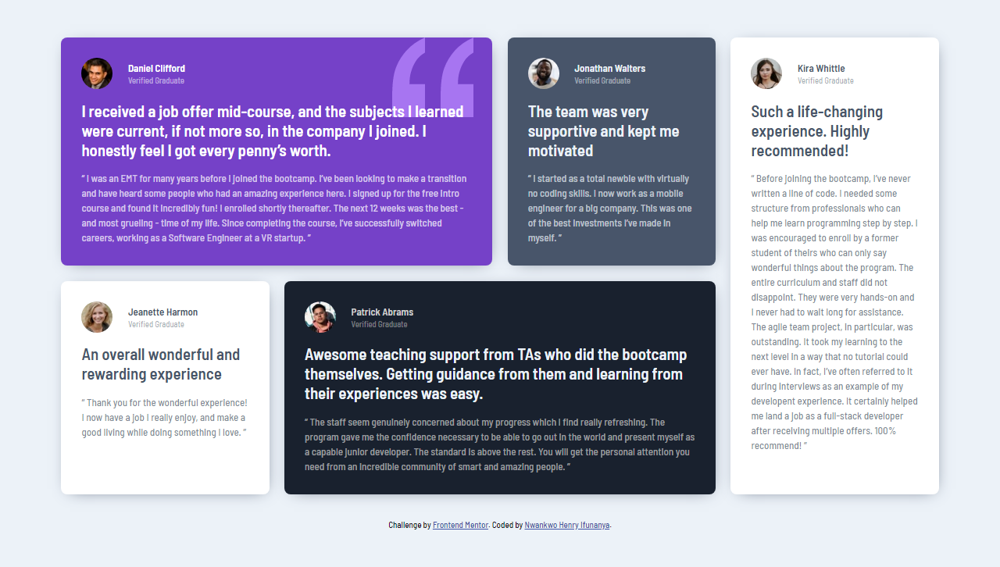

# Frontend Mentor - Testimonials grid section solution

This is a solution to the [Testimonials grid section challenge on Frontend Mentor](https://www.frontendmentor.io/challenges/testimonials-grid-section-Nnw6J7Un7). Frontend Mentor challenges help you improve your coding skills by building realistic projects.

## Table of contents

- [Overview](#overview)
  - [The challenge](#the-challenge)
  - [Screenshot](#screenshot)
  - [Links](#links)
- [My process](#my-process)
  - [Built with](#built-with)
  - [What I learned](#what-i-learned)
  - [Continued development](#continued-development)
  - [Useful resources](#useful-resources)
- [Author](#author)
- [Acknowledgments](#acknowledgments)

## Overview

### The challenge

Users should be able to:

- View the optimal layout for the site depending on their device's screen size

### Screenshot

**Mobile**

**Desktop**

### Links

- Solution URL: [Solution of testimonials grid section main challenge on Frontend Mentor](https://www.frontendmentor.io/solutions/mobile-first-approach-grid-of-testimonials-using-css-custom-properties-CrfPPp9zl)
- Live Site URL: [Live site of testimonials grid section main challenge](https://momenihin.github.io/testimonials-grid-section-main/)

## My process

### Built with

- Semantic HTML5 markup
- CSS custom properties
- CSS Grid
- Mobile-first workflow

### What I learned

I have learnt more about css grid

### Continued development

1. CSS grid
2. CSS animations

### Useful resources

- [w3schools](https://www.w3schools.com) - This helped me in applying the display property of grid to the desktop version of the work.

## Author

- Website - [Nwankwo Henry Ifunanya](https://www.github.com/momenihin)
- Frontend Mentor - [@momenihin](https://www.frontendmentor.io/profile/momenihin)
- Twitter - [@momenihin](https://www.twitter.com/momenihin)

## Acknowledgments

A big thanks to [Frontend Mentor](https://www.frontendmentor.io)
